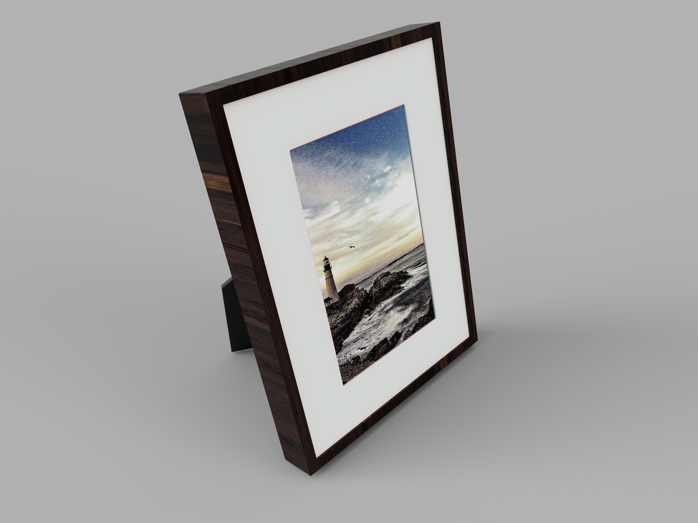
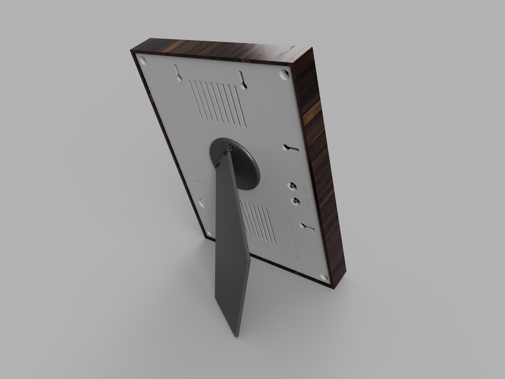
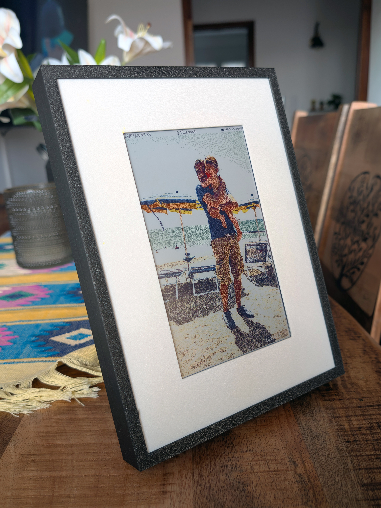
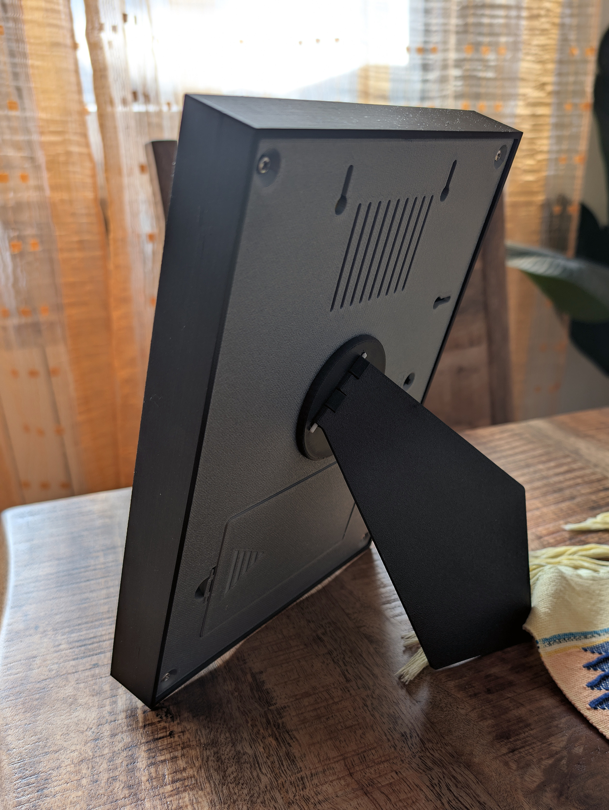
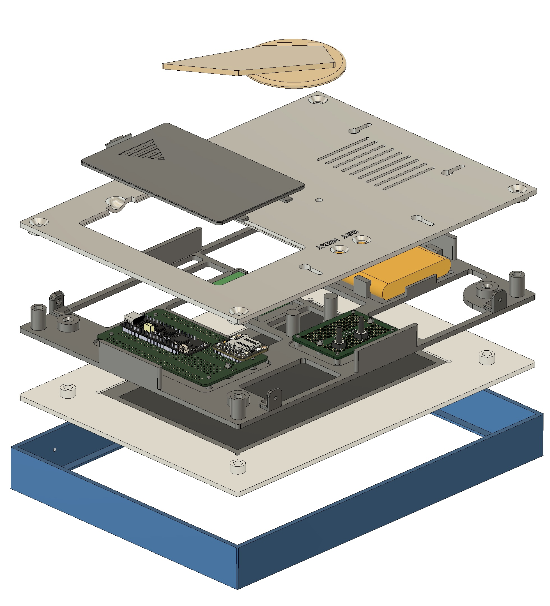
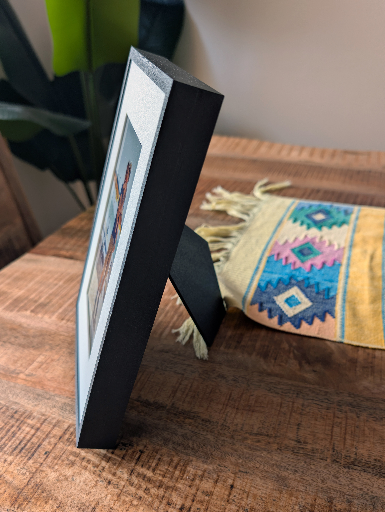

# ESP32 E-Paper Photo Frame

|  |  |
|--|--|
|  |  |
|  |  |
|  |  |
|  |  |

## Introduction

**ESP32 E-Paper Photo Frame** is an open-source project designed to turn a low-power e-paper display into a smart, battery-efficient digital photo frame. Built around the ESP32 ecosystem, it offers a seamless way to display your memories using modern connectivity or local storage.

Unlike traditional LCD photo frames, this project leverages **e-paper technology** to achieve months of battery life on a single charge, providing a paper-like aesthetic that blends naturally into any home environment.

The system is designed as a complete ecosystem containing:
- **Smart Firmware**: An efficient ESP32 firmware that manages power, WiFi, and display rendering.
- **Cross-Platform Tools**: A suite of powerful tools (Rust CLI, Flutter Desktop & Mobile Apps) to process and optimize images specifically for e-paper displays.
- **Flexible Data Sources**: Fetch images from the cloud (Google Drive), local SD card, or upload them directly via WiFi.

The project also provides a **complete hardware solution**:
- **3D Printable Enclosure**: A custom-designed case available in `assets/3d model`.
- **Hardware Guides**: Comprehensive instructions for building the device, including the [Assembly Guide](docs/assembly_guide.pdf) and [Wiring Schematics](docs/pros3d_schematics.pdf).

## Hardware Requirements

To build this project, you will need the following core components. A detailed bill of materials is available in the [Assembly Guide](docs/assembly_guide.pdf).

### Essential Components
| Component | Recommendation | Notes |
|-----------|----------------|-------|
| **Microcontroller** | [Unexpected Maker ProS3-D](https://unexpectedmaker.com/shop.html#!/ProS3-D/p/759221737) | ESP32-S3 with PSRAM (Required for image buffer) |
| **Display** | [Good Display 7.3" ACeP](https://www.good-display.com/blank7.html?productId=533) | 800×480, 6-Color (GDEP073E01) |
| **Adapter** | [DESPI-C73](https://www.good-display.com/product/522.html) | Connection interface for the display |
| **Storage** | [Adafruit MicroSD SPI/SDIO](https://learn.adafruit.com/adafruit-microsd-spi-sdio) | High-speed SDIO support for faster image loading |
| **Battery** | 3.7V LiPo (5000mAh+) | Required for portable operation |

### Supported Hardware
The firmware is flexible and supports multiple configurations:
- **MCU**: Unexpected Maker FeatherS3, ProS3.
- **Displays**: 
  - **7.3" 6-Color (GDEP073E01)**: Logic for dithering and palette mapping included.
  - **7.5" Black & White (GDEY075T7)**: Fully supported for high-contrast monochrome images.

## Key Features

- **Ultra-Low Power**: Designed for longevity, the frame enters deep sleep between updates, lasting months on a standard LiPo battery.
- **E-Paper Optimized**: Leverages multiple dithering algorithms (Floyd-Steinberg, Atkinson, etc.) and a custom 6-color palette (via `.pfr1` format) to transform any image into a stunning e-ink display.
- **Smart & Autonomous**:
    - **Cloud Mode**: Connects to Google Drive to fetch and display random images at set intervals.
    - **Offline Mode**: Cycles through images stored locally on the SD Card.
    - **Local WiFi Mode**: Functions as a static display, updated instantly via the mobile or desktop app.
    - **Night Mode**: Automatically pauses updates during sleeping hours to save energy.
    - **Smart Cropping**: Integrated AI (InsightFace) detects faces to automatically center and crop images for the best composition.
- **Zero-Recompile Config**: All settings (WiFi, schedules, refresh intervals) are managed via a simple `config.json` file on the SD card—no programming knowledge required to tweak settings.
- **📱 Cross-Platform Ecosystem**:
    - **Desktop**: Drag-and-drop processing tool for macOS/Windows/Linux.
    - **Mobile**: Dedicated companion app for managing and uploading photos directly from your phone via WiFi.

## Architecture Overview

The system operates on a clear pipeline:
1.  **Input**: Images are taken from your phone, computer, or cloud storage.
2.  **Processing**: Images are resized, dithered, and converted into the efficient `.pfr1` binary format by the provided tools (Rust CLI / Desktop App / Mobile App).
3.  **Transfer**: Processed files are moved to the frame via SD Card, Google Drive, or WiFi.
4.  **Display**: The ESP32 wakes up, loads the image, renders it to the e-paper screen, and returns to deep sleep.

## Project Structure

| Directory | Description |
|-----------|-------------|
| **`platformio/`** | The ESP32 firmware source code (C++). Handles WiFi, display driving, and power management ([**Overview**](docs/FIRMWARE_OVERVIEW.md)). |
| **`rust/`** | High-performance tools handling the `.pfr1` ([**file format specs**](docs/BINARY_FILE_FORMAT.md)) format logic. [**Overview**](docs/RUST_OVERVIEW.md) of the core library, CLI processor, and InsightFace integration. |
| **`flutter/`** | Cross-platform applications [**Overview**](docs/FLUTTER_OVERVIEW.md). <br>• `desktop/`: GUI for the Rust processor (macOS/Windows/Linux).<br>• `mobile/`: iOS/Android app for WiFi transfers. |
| **`assets/`** | Resources including the **3D printable enclosure** (`3d model/`) and screenshots. |
| **`docs/`** | Detailed technical documentation, API references, and assembly guides. |
| **`extras/`** | Additional utilities, such as macOS QuickLook plugins for previewing `.pfr1` files. |

## Quick Start

Follow these steps to get your frame running:

### 1. Firmware & Hardware
1.  **Assemble**: Follow the [Assembly Guide](docs/assembly_guide.pdf) to build the hardware.
2.  **Flash Firmware**:
    - Install **Visual Studio Code** and the **PlatformIO** extension.
    - Open the `platformio/` folder.
    - Select your board (e.g., `pros3d_unexpectedmaker`) and click **Build** and **Upload**.
    - *See [Firmware Overview](docs/FIRMWARE_OVERVIEW.md) for detailed instructions.*

### 2. Configuration (SD Card)
1.  Format a microSD card (FAT32).
2.  Create a `config.json` file in the root.
3.  Add your WiFi and Component settings.
    ```json
    {
      "wifi": [{"ssid": "MyWifi", "password": "pass"}],
      "sd_card_config": {"enabled": true, "directories": ["/images"]},
      "google_drive_config": {"enabled": false}
    }
    ```
    *See [Configuration Reference](docs/CONFIG_REFERENCE.md) for all options.*

### 3. Image Processing
The frame requires images in the custom `.pfr1` format. Use one of our tools:

- **Desktop App (GUI)**: Drag-and-drop tool for macOS/Windows/Linux.  
  [👉 Desktop App Guide](flutter/desktop/README.md)
- **Mobile App**: Process and upload directly from your phone.  
  [👉 Mobile App Guide](flutter/mobile/README.md)
- **CLI Tool**: Power-user tool for batch processing.  
  [👉 Rust Tools Overview](docs/RUST_OVERVIEW.md)

### 4. Upload Images
Choose your preferred method:
- **SD Card**: Copy `.pfr1` files directly to the SD card.
- **Google Drive**: Upload files to your Drive folder.  
  [👉 Google Drive Setup](docs/GOOGLE_DRIVE.md)
- **WiFi**: Use the Mobile or Desktop App to upload images wirelessly (requires `ENABLE_WEBSERVER_DATAPROVIDER` firmware build).  
  [👉 WiFi Guide](docs/WIFI.md)

For detailed technical documentation, please refer to the `docs/` folder.