# Display Power Control

## 📋 Overview

This guide describes two methods to implement power control for the GDEP073E01 e-paper display:
1. **ProS3 Native Solution**: Using the built-in LDO2 control (no external components)
2. **Universal P-MOSFET Solution**: For other boards using external P-MOSFET

Both methods allow you to completely power off the display when not in use, resolving SPI conflicts and drastically reducing power consumption.

## 🎯 Benefits

1. **SPI Conflict Resolution**: Display can be completely powered off during SD card operations
2. **Energy Savings**: From ~100µA to 0mA in deep sleep
3. **Hardware Reset**: Ability to perform a complete power cycle of the display
4. **Increased Battery Life**: +20-40 hours on a 2000mAh battery
5. **Reliability**: Eliminates display initialization issues after deep sleep

## ⚡ Technical Specifications

### GDEP073E01 Display
- **Operating voltage**: 3.3V
- **Sleep mode consumption**: ~100µA
- **Refresh consumption**: 35-50mA (peaks up to 80-100mA)
- **Idle consumption**: ~5mA

### ESP32 GPIO Limits
- **Maximum current per pin**: 40mA (absolute)
- **Safe current per pin**: 20mA (recommended)
- **Conclusion**: ⚠️ **DO NOT connect the display directly to GPIO!**

## 🚀 Method 1: ProS3 Native Solution (Recommended for ProS3)

### How it Works
The Unexpected Maker ProS3 board includes a second LDO (Low Dropout Regulator) that can be controlled via GPIO17:
- **GPIO17 = HIGH**: LDO2 outputs 3.3V (display powered)
- **GPIO17 = LOW**: LDO2 outputs 0V (display unpowered)
- **Current capacity**: 500mA+ (sufficient for e-paper displays)

### Wiring for ProS3
```
ProS3 3V3_LDO2 Output → Display VCC
ProS3 GND            → Display GND
(Other SPI connections remain unchanged)
```

### Configuration for ProS3
```cpp
// In platformio/include/config/pros3d_unexpectedmaker.h
#define DISPLAY_POWER_PIN 17
#define DISPLAY_POWER_ACTIVE_LOW 0  // HIGH = ON, LOW = OFF
```

### Advantages
- ✅ No external components needed
- ✅ Built-in protection (thermal, overcurrent)
- ✅ Cleaner wiring
- ✅ Professional-grade power control
- ✅ Zero additional cost

## 🔧 Method 2: P-MOSFET Solution (Universal)

### Recommended P-MOSFETs

#### 1. **IRF9540N** (TO-220) - ⭐ BEST CHOICE
- **Vds**: -100V
- **Id**: -23A continuous
- **Rds(on)**: 0.117Ω @ Vgs=-10V
- **Vgs(th)**: -2V to -4V
- **Package**: TO-220 (easy to solder)
- **Price**: ~$1-2
- **Pros**: Very common, robust, low resistance
- **Cons**: Large package

#### 2. **Si2301** (SOT-23) - For PCB
- **Vds**: -20V
- **Id**: -3A
- **Rds(on)**: 0.12Ω @ Vgs=-4.5V
- **Package**: SOT-23 (SMD)
- **Pros**: Compact, perfect for PCB

#### 3. **AO3401** (SOT-23) - SMD Alternative
- **Vds**: -30V
- **Id**: -4.2A
- **Rds(on)**: 0.05Ω @ Vgs=-4.5V
- **Package**: SOT-23 (SMD)

### Other Components
- 2× 10kΩ resistors (1/4W)
- 1× 100µF electrolytic capacitor (optional but recommended)
- Wires and connectors

## 📐 Wiring Diagram

### Electrical Schematic

```
ESP32 3.3V ────────────────────┐
                               │
                               S (Source)
                               │
                          [P-MOSFET]
                          IRF9540N
                               │
ESP32 GPIO13 ──[10kΩ]─────────G (Gate)
                   │           │
                 [10kΩ]        │
                   │           D (Drain)
ESP32 3.3V ────────┘           │
                               ├──→ Display VCC
                               │
                            [100µF]
                               │
ESP32 GND ─────────────────────┼──→ Display GND
```

### IRF9540N Pinout (TO-220)

```
        Front View
     ┌─────────────────┐
     │  IRF9540N       │ ← Flat side
     │                 │
     │  ○     ○     ○  │
     │  │     │     │  │
     └──┴─────┴─────┴──┘
        G     D     S
      Pin 1  Pin 2  Pin 3
      Gate   Drain  Source
```

### Connection Table

| From | To | Component | Notes |
|---|---|---|---|
| ESP32 3.3V | MOSFET Pin 3 (S) | Direct wire | Always-on power supply |
| ESP32 GPIO13 | MOSFET Pin 1 (G) | 10kΩ resistor | ON/OFF control |
| ESP32 3.3V | MOSFET Pin 1 (G) | 10kΩ resistor | Pull-up for safe OFF state |
| MOSFET Pin 2 (D) | Display VCC | Direct wire | Switched power |
| Display VCC | Capacitor + | 100µF | Stabilization (optional) |
| Capacitor - | ESP32 GND | Direct wire | Common ground |
| Display GND | ESP32 GND | Direct wire | Common ground |

## 🔌 Breadboard Assembly

### Recommended Layout

```
BREADBOARD - Top View
═══════════════════════════════════════════════════

Power Rails
+ ──────────────────────────────────────────── +
- ──────────────────────────────────────────── -

     A    B    C    D    E     F    G    H    I    J

6    ●────●────●              [IRF9540N mounted here]
     G    D    S              Gate|Drain|Source

10                                      ●→ Display VCC
12                                      ● [Cap +]
14                                      ● [Cap -]
16   ●───[10kΩ]───● ←──────────────────── GPIO13
18   ●───[10kΩ]───●
20   ●←─────────────────────────────────── 3.3V

21                                      ●→ Display GND
                                        ↓
- ────────────────────────────────────[GND]──── -
```

### Wire Color Codes
- 🔴 **Red**: 3.3V (power supply)
- 🟡 **Yellow**: Display VCC (switched power)
- 🔵 **Blue**: GPIO13 (control signal)
- ⚫ **Black**: GND (ground)

## 💻 Software Implementation

### 1. Board Configuration

Add to `platformio/include/config/[your_board].h`:

```cpp
// Display power control
#define DISPLAY_POWER_PIN 13  // Adjust based on your board
#define DISPLAY_POWER_ACTIVE_LOW 1  // P-MOSFET: LOW=ON, HIGH=OFF
```

### 2. Control Functions

```cpp
void display_power_on() {
    #ifdef DISPLAY_POWER_PIN
        digitalWrite(DISPLAY_POWER_PIN, LOW);  // P-MOSFET: LOW = ON
        delay(200);  // GDEP073E01 stabilization
    #endif
}

void display_power_off() {
    #ifdef DISPLAY_POWER_PIN
        digitalWrite(DISPLAY_POWER_PIN, HIGH);  // P-MOSFET: HIGH = OFF
        delay(50);
    #endif
}

void init_display_power() {
    #ifdef DISPLAY_POWER_PIN
        pinMode(DISPLAY_POWER_PIN, OUTPUT);
        display_power_off();  // Start with display OFF
        delay(100);
    #endif
}
```

### 3. SPI Phase Management

```cpp
void main_operation() {
    // PHASE 1: SD Card Operations (Display OFF)
    display_power_off();
    sd_card.begin();
    // ... SD card operations ...
    sd_card.end();

    // PHASE 2: Display Operations (Display ON)
    display_power_on();
    display.init();
    // ... render image ...
    display.sleep();

    // PHASE 3: Deep Sleep (Display OFF)
    display_power_off();
    esp_deep_sleep_start();
}
```

## 🧪 Circuit Testing

### Testing with Multimeter

1. **MOSFET OFF (GPIO13 = HIGH)**
   - Measure between Drain and GND: 0V
   - Display off

2. **MOSFET ON (GPIO13 = LOW)**
   - Measure between Drain and GND: 3.3V
   - Display powered

### Test Code

The file `platformio/src/display_debug.cpp` contains complete tests:

```cpp
// Enable tests in platformio.ini
-D ENABLE_DISPLAY_DIAGNOSTIC=1

// Available tests:
// 1. Power Control Test - Basic ON/OFF cycles
// 2. SD Card Image Test - Test with SPI phases
// 3. Full Test - Complete test with rendering
```

### Compiling Tests

```bash
cd platformio
source .venv/bin/activate
pio run -e pros3d_unexpectedmaker -t upload
pio run -t monitor
```

## 📊 Power Consumption Measurements

### Without Power Control
| State | Display Consumption | Total Consumption |
|-------|-----------------|----------------|
| Deep Sleep | ~100µA | ~150µA |
| Idle | ~5mA | ~45mA |
| Refresh | 35-50mA | 85-100mA |

### With Power Control
| State | Display Consumption | Total Consumption | Savings |
|-------|-----------------|----------------|-----------|
| Deep Sleep | 0mA | ~50µA | **-100µA** |
| Idle | 0mA (off) | ~40mA | **-5mA** |
| Refresh | 35-50mA | 85-100mA | - |

### Battery Impact (2000mAh)
- **Without control**: ~550 hours in deep sleep
- **With control**: ~830 hours in deep sleep
- **Gain**: +280 hours (+51%)

## 🔍 Troubleshooting

### Display doesn't turn on
- Check Gate voltage: should be 0V for ON, 3.3V for OFF
- Check MOSFET orientation (Gate-Drain-Source)
- Measure Gate-3.3V resistance: should be ~20kΩ

### Display turns off randomly
- Add 100µF capacitor on display VCC
- Check solder joints and connections
- Ensure GPIO13 is not floating

### High consumption in deep sleep
- Verify display_power_off() is called before deep sleep
- Measure Drain voltage: should be 0V when OFF
- Check that MOSFET is not damaged

### ESP32 resets during refresh
- Inadequate or damaged MOSFET
- Insufficient power supply (use external power for testing)
- Missing or insufficient capacitor

## 📚 Mermaid Diagrams

### Control Flow


### Connection Diagram

```mermaid
graph TB
    subgraph ESP32
        V33[3.3V Pin]
        GND1[GND Pin]
        GPIO[GPIO13]
    end

    subgraph MOSFET[IRF9540N]
        S[Source]
        D[Drain]
        G[Gate]
    end

    subgraph Display
        VCC[VCC Pin]
        GND2[GND Pin]
    end

    V33 --> S
    V33 -.->|10kΩ| G
    GPIO -->|10kΩ| G
    D --> VCC
    D -->|100µF| GND1
    GND1 --> GND2
```



## 🤔 Which Method to Choose?

### Use ProS3 Native Solution if:
- ✅ You have an Unexpected Maker ProS3 board
- ✅ You want the simplest solution with no external components
- ✅ You prefer a cleaner, more professional build

### Use P-MOSFET Solution if:
- ✅ You have any other ESP32 board (FeatherS3, ESP32-C6, etc.)
- ✅ You want a universal solution that works with any board
- ✅ You're comfortable with basic electronics assembly

## ✅ Implementation Checklist

- [ ] Purchase components (MOSFET, resistors, capacitor)
- [ ] Assemble circuit on breadboard
- [ ] Test with multimeter (voltages and currents)
- [ ] Modify board configuration (`DISPLAY_POWER_PIN`)
- [ ] Compile and upload test firmware
- [ ] Verify ON/OFF cycles with serial monitor
- [ ] Measure actual consumption in each state
- [ ] Integrate into main code
- [ ] Complete test with normal cycle
- [ ] Document final results and consumption

## 📖 References

- [IRF9540N Datasheet](https://www.infineon.com/dgdl/irf9540n.pdf)
- [ESP32 GPIO Current Limits](https://docs.espressif.com/projects/esp-idf/en/latest/esp32/api-reference/peripherals/gpio.html)
- [GDEP073E01 Specifications](https://www.good-display.com/product/432.html)

---

**Note**: This modification is optional but highly recommended for battery-powered projects or those with SPI conflicts between display and SD card.